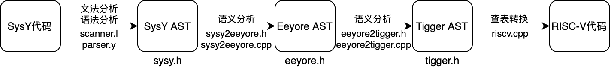
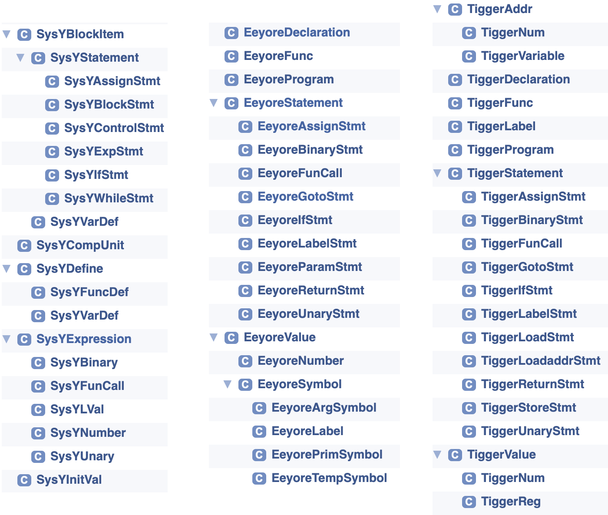

# SysYCompiler

## 概述

本项目实现了 [SysY 语言](https://gitlab.eduxiji.net/nscscc/docs/-/raw/master/SysY语言定义.pdf)的编译器，可以将 SysY 语言的源程序分别编译到 [Eeyore](https://pku-minic.github.io/online-doc/#/ir/eeyore)、[Tigger](https://pku-minic.github.io/online-doc/#/ir/tigger) 中间语言和 [RISC-V](https://github.com/riscv/riscv-isa-manual) 目标语言。

## 设计

### 框架



本编译器的基本流程如上图所示。输入 SysY 代码，经过 4 个转换步骤，最终生成翻译得到的 RISC-V 代码。我为 SysY、Eeyore、Tigger 都设计了一个 AST，分别在 `sysy.h`、`eeyore.h`、`tigger.h` 中定义。首先，读入 SysY 代码，通过基于 Lex 和 Yacc 的文法分析和语法分析生成对应的 SysY AST，然后依次通过 `sysy2eeyore.(h|cpp)` 和 `eeyore2tigger.(h|cpp)` 的语义分析转换成 Eeyore AST 和 Tigger AST，最后通过 `riscv.cpp` 中的查表转换算法生成最终的 RISC-V 代码。

### 类图



上图显示了 SysY、Eeyore、Tigger 的 AST 结构所用到的类及它们之间的继承关系，这些 AST 都是按照对应语言的文法定义进行实现的。

举例来说，虚类 `SysYStatement` 表示一条 SysY 语句，它可以是 `SysYAssignStmt` 赋值语句、`SysYBlockStmt` 语句块、`SysYControlStmt` 控制语句、`SysYExpStmt` 表达式语句、`SysYIfStmt` 判断语句、`SysYWhileStmt` 循环语句。`SysYBlockStmt` 语句块内有一个 `SysYBlockItem` 的 `vector`，而 `SysYBlockItem` 可以是 `SysYStatement` 或 `SysYVarDef` 变量定义。

此外，`SysYCompUnit`、`EeyoreProgram`、`TiggerProgram` 分别作为三个语言的根节点类。

### 主要算法设计考虑

在设计 AST 时，我遵循的一个原则是一个语言的 AST 在设计时只考虑该语言本身的语法，而不考虑它与其他 IR 之间如何转换。最开始，考虑到中间语言之间的相似性，我试图在设计 AST 时添加一些额外的信息来合并不同的中间语言的 AST，或是降低中间语言转换时的难度，然而反而导致了代码的混乱。最后，我决定每个语言的 AST 只考虑该语言自己，并为每一轮转换设计一个 `Transformer` 类用来存储转换时额外需要维护的信息，这样不仅能使代码结构清晰明了，还能适应多种源语言和多种目标语言的情况。

### 符号表

在 SysY2Eeyore 和 Eeyore2Tigger 两个语义分析阶段，都会维护一个符号表，当访问一个变量时需要从符号表中查找对应的变量信息。两个阶段的符号表的表项内容不同，符号表用 `NestedMap` 数据结构维护，这是一个嵌套的 map 结构，用来模拟嵌套的作用域，当在当前作用域找不到时会递归的到上一层作用域查找。`NestedMap` 的部分代码：

```C++
template<class K, class V>
class NestedMap {
private:
    NestedMap *outer;
    std::map<K, V> *map;
public:
    V *find(const K &key) {
        auto it = map->find(key);
        if (it != map->end())return &it->second;
        else if (outer) return outer->find(key);	// 到外层作用域查找
        else return nullptr;
    }
    bool insert(const K &key, const V &val) {
        if (map->count(key))return false;	// 禁止重复定义
        map->insert({key, val});
        return true;
    }
}
```


### 类型检查

除了文法分析和语法分析阶段的错误检查由 lex 和 yacc 处理，其他语法错误都在 SysY2Eeyore 阶段进行检查。类型检查有两类，一类是会导致编译器 RE 的语义错误，一类是会导致编译出的程序 RE 的语义错误。对于第一类，重点在于通知用户发生了什么错误，第二类错误则更重要，如果没有检测出来则会导致成功编译的程序运行结果出错。

本编译器在 SysY2Eeyore 的语义分析阶段，一旦发现可能的语法错误，就会立即停止并输出错误原因，支持的错误检查包括：全局表达式计算结果必须是常数、数组不能被标量初始化、不能在同一个作用域内重复定义变量等……

## 实现

### 文法分析与语法分析

文法分析和语法分析可以手动实现，也可以用 lex 和 yacc 实现。使用 lex 和 yacc 的好处是非常简洁，同时可以方便的修改语法，如果手动实现一旦修改语法则可能需要重新设计算法。

lex 进行文法分析，只需设计好正则表达式即可。数字的正则表达式设计需要注意支持不同进制的数：`([1-9][0-9]*)|(0[0-7]*)|(0(x|X)[0-9a-fA-F]+)`。块注释则利用 BEGIN 功能实现：

```
"/*"            BEGIN COMMENT;
<COMMENT>"*/"   BEGIN INITIAL;
<COMMENT>.|\n   ;
```

但要注意的是在用这种方式实现块注释的情况下，对运算符号的识别不能简单的读取所有连续的符号然后匹配，因为可能导致 `/**` 无法被识别为注释开头，需要对每种运算符号单独识别。

yacc 进行语法分析，只需要设计好 BNF 与对应的语义动作，用于在识别语法的同时生成 SysY AST。例如：

```
MulExp: UnaryExp
      | MulExp MUL UnaryExp { $$ = new SysYBinary($1, $2, $3); }
      | MulExp DIV UnaryExp { $$ = new SysYBinary($1, $2, $3); }
      | MulExp MOD UnaryExp { $$ = new SysYBinary($1, $2, $3); }
      ;
```

大括号内描述了语义动作， 其中，`$1`、`$2` 依次代表前面的文法符号的第 1、2 项，`$$` 表示返回值。

需要额外注意数组下标这类递归数据结构的生成，通过维护一个 vector 实现：

```
ArrayBlock:       { $$ = new std::vector<std::shared_ptr<SysYExpression>>; }
| '[' Exp ']'     { $$ = new std::vector<std::shared_ptr<SysYExpression>>; 
					$$->push_back(std::shared_ptr<SysYExpression>($2)); }
| ArrayBlock '[' Exp ']'  { $$ = $1; $$->push_back(std::shared_ptr<SysYExpression>($3));}
;
```

### SysY2Eeyore

SysY2Eeyore 阶段将上一阶段生成的 SysY AST 转换为 Eeyore 的 AST。

其中核心部分是一个 `S2ETransformer` 类，用于维护转换所需的信息，其中包括：生成的 Eeyore AST 的根节点指针 `root`、`T_cnt, t_cnt, p_cnt, l_cnt` 等变量 id 计数器、符号表 `vars`、函数表 `funcs`、当前正在处理的函数指针 `func` 和 函数表项 `func_entry`、记录嵌套循环在 break 和 continue 时跳转到的位置的 label 的栈 `break_stack` 和 `continue_stack`。

函数表项 `S2EFuncEntry` 中记录了是否无返回值 `is_void`，若有返回值则需要在函数调用时将返回值赋给临时变量。还记录了函数参数列表 `params`，用于在函数调用时进行参数匹配检查。

符号表项 `S2ESymbolEntry` 中记录了数组维数 `dim`、占用字节数 `size`、步长数组 `stride`，这些信息用于翻译数组访问时计算下标。还记录了是否是常量 `is_const` （仅在数组时有用）和值数组 `value`（仅在常量数组时有用），数组访问时如果数组是常量且下标也是常量则会直接从 `value` 数组中找到对应的值。还记录了一个 `EeyoreValue` 指针，表示对应的符号或是常量整数。

需要注意的是表达式的转换，SysY 支持复杂的表达式，而 Eeyore 一个表达式只能有一次运算，因此需要将 SysY 的表达式拆分为多个表达式，通过临时变量连接。此外，还要对常数自动的计算，在运算时，如果运算数都是常数，则不需要新建表达式，直接返回计算结果的常数。这是因为 SysY 的数组大小、初始化值都可以是常数表达式，而在 Eeyore 中必须是一个常数，所以必须进行转化。

在运算符中，`AND` 和 `OR` 比较特殊，因为需要支持短路计算，通过条件跳转的方式实现，与 if 语句的实现比较类似。

在翻译 `if`、`while`、`break`、`continue` 这些控制语句时，需要合理的安排语句的顺序，以及 Label 的位置，因为 Eeyore 需要通过 goto 跳转来实现控制结构。为了支持 `continue` 和 `break`，我们维护两个栈，每当进入一个 `while` 结构中时，在循环开始处创建 `continue_label`，在循环结束后创建 `break_label`，并压入栈中，当遇到 `continue` 或 `break` 时则从栈中找到对应的 Label 进行跳转。

SysY 的初始化表达式比较复杂，我设计了一个递归的算法将初始化列表转换为初始值的数组：

```C++
void generateInit(const std::vector<std::shared_ptr<SysYInitVal>> &inits, int dim,
                  const std::vector<int> &stride,
                  std::vector<std::shared_ptr<EeyoreValue>> &dst, int begin, int end) {
    if (dim == stride.size()) logError("initexpr too much dimension");
    for (const auto &init:inits) {
        if (begin >= end) logError("initexpr too long");
        if (init->exp()) {
            dst[begin++] = init->exp()->genEeyore(this);
        } else {
            if (begin % (stride[dim] / 4) != 0) logError("initexpr stride mismatch");
            generateInit(*init->list(), dim + 1, stride, dst, begin, 
                         begin + stride[dim] / 4);
            begin += stride[dim] / 4;
        }
    }
    while (begin < end) dst[begin++] = std::make_shared<EeyoreNumber>(0);
}
```

当遇到定义变量的语句时，我们根据是否是常数、是否是数组、是否有初始化等信息进行复杂的分类讨论，最终创建符号表项，并加入到符号表中。

每当进入一个 Block 或一个函数中时，调用符号表的 `nest` 方法，会为当前作用域创建一个新的 map，并作为最高优先级。当离开一个 Block 或函数时，调用符号表的 `unnest` 方法，会删除最表层的一个 map，恢复到上一层作用域。`NestedMap` 的部分代码：

```C++
template<class K, class V>
class NestedMap {
private:
    NestedMap *outer;
    std::map<K, V> *map;
public:
    void nest() {
        outer = new NestedMap(outer);
        outer->map = map;
        map = new std::map<K, V>;
    }
    void unnest() {
        delete map;
        map = outer->map;
        outer = outer->outer;
    }
}
```

此外，为了支持 SysY 运行时库中的函数，需要提前为运行时库中的这些函数创建对应的函数表项并加入函数表中，以便调用函数时能找到对应的函数签名。

### Eeyore2Tigger

Eeyore2Tigger 阶段的数据结构与上一阶段类似，但是不需要函数表，需要维护的其他信息也更少。需要 `v_cnt, p_cnt` 两个计数器、符号表、初始化语句列表、根节点、当前函数。符号表项中也只需要维护在栈中的位置偏移量 `offset`、是否是数组 `is_array` 和符号指针 `var`。

此阶段最重要的任务是进行寄存器分配，由于我采用不分配的方案，即为每个变量在栈中指定一块空间，当需要使用时从栈中读取到寄存器中，运算完后立刻存回栈，因此比较简单。通过合理的分配寄存器，我只使用了寄存器 `t1` 和 `t2`，在返回值时使用 `a0`。

我做了一个小小的优化，由于 RISC-V 某些规则的原因，Tigger 中 `+` 和 `<` 运算符作为 `Reg = Reg BinOp NUM` 语句中的 `BinOp` 时会较为方便。因此我会检测如果遇到 `NUM + REG` 或 `NUM > REG` 的情况则会交换两个运算数并更改合适的运算符。

### 生成RISC-V

最终，我们可以用 Tigger AST 直接生成 RISC-V 代码。

大部分情况直接查表翻译就行了，需要额外注意的是遇到立即数的情况，RISC-V 的规则是在一些地方小于 12 位或 10 位的立即数能直接使用，如果太大了则需要先 `li` 到一个寄存器中再使用，因为之前中没有用到 `t0`，我就把 `t0` 用来存放被加载的立即数。

还有一个需要注意的是 `return` 语句翻译时需要用到 `STK`，即需要知道当前函数的栈有多大，因此我们在翻译时还需要将当前的函数作为参数传递。

在这一阶段的一个优化是需要 `li` 立即数 0 的时候可以直接使用 `x0` 代替。

### 测试

我在调试阶段遇到的错误不多，并都能在提供的 open-test-case 中找到。

在 SysY2Eeyore 阶段遇到的一个错误是在数组相关的测试中编译器 RE 了。经过调试发现，是访问了野指针造成的。原本我在 SysY AST 中使用的都是普通的指针，手动进行垃圾回收，每个节点在析构时都会删除它的所有子节点。这种方法在其他时候都没问题，只会在数组访问时可能出错，因为数组访问时，为了翻译多维下标访问，我手动创建了几条表达式，导致一些变量节点被多次引用。最终为了简化逻辑，我把所有普通指针都改为了智能指针 `shared_ptr`。

Eeyore2Tigger 阶段没有遇到什么大错误，只是调整了一下寄存器的分配，以及注意一下函数名前面是否需要 `f_`。

最终生成 RISC-V 的阶段，因为没有理解“请先使用 `li` 伪指令将该整数加载到 `t0` 中, 然后再使用以 `t0` 寄存器作为操作数的指令执行相同操作”的意思，以为把原指令立即数的位置换成 `t0` 就行了，结果导致 RE。后来才知道这些位置只能是立即数不能是寄存器。在例如 `int12(sp)` 的情况下，可以把 `sp` 加到 `t0` 上，然后使用 `0(t0)` 即可。

其它一些细节错误就不赘述了。

## 总结

在本次实习实践中，我从零开始构建了一个编译器，原本如同黑盒般的编译器显得不再复杂。

在实习过程中，最难的一步就是起步，需要对编译器的功能模块进行划分，并使每一部分的正确性能够简单验证。

实习中的一个问题是 lex 和 yacc 的使用。由于大部分教程都是在 C 语言中使用 lex 和 yacc，对于如何配合 C++ 正确编写和编译 lex 和 yacc 代码我毫无头绪，曾一度放弃使用 lex 与 yacc。最后看到了 C++ 使用 lex 与 yacc 的示例代码和 MakeFile 才成功的用上了 lex 与 yacc。

另一个问题是，课程内容的进度跟不上实习进度的问题。课程关于寄存器分配的内容在比较靠后才教到，实际上，在学到寄存器分配相关内容之前我就完成了完整的编译器，这就导致我在进行寄存器分配时无从下手，最终决定使用不分配的策略。